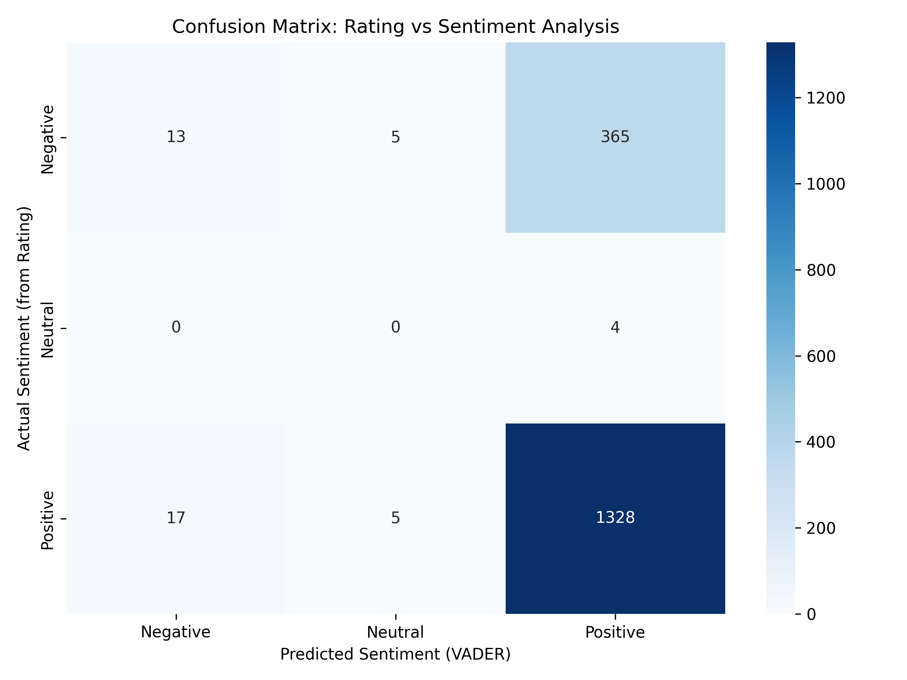

# Customer Review & Sentiment Analysis Results Report

## Overview

This project applies Natural Language Processing (NLP) techniques to analyze customer sentiment from Amazon product reviews. Using VADER sentiment analysis, topic modeling (LDA), and aspect-based sentiment extraction, we uncover what drives customer satisfaction and dissatisfaction across product categories.

### Key Findings at a Glance

| Metric                               | Value     | Insight                          |
| ------------------------------------ | --------- | -------------------------------- |
| **Total Reviews Analyzed**     | 1465      | Comprehensive dataset coverage   |
| **Overall Sentiment Accuracy** | 77.2%     | VADER prediction vs star ratings |
| **Positive Sentiment**         | 97.4%     | Dominant sentiment category      |
| **Negative Sentiment**         | 1.9%      | Critical feedback percentage     |
| **Neutral Sentiment**          | 0.7%      | Mixed/ambivalent opinions        |
| **Avg. Review Length**         | 239 words | Pre-cleaning                     |
| **Avg. Cleaned Length**        | 127 words | Post-processing                  |

## 1. Sentiment Distribution Analysis

### 1.1 Overall Sentiment Breakdown

<pre class="font-ui border-border-100/50 overflow-x-scroll w-full rounded border-[0.5px] shadow-[0_2px_12px_hsl(var(--always-black)/5%)]"><table class="bg-bg-100 min-w-full border-separate border-spacing-0 text-sm leading-[1.88888] whitespace-normal"><thead class="border-b-border-100/50 border-b-[0.5px] text-left"><tr class="[tbody>&]:odd:bg-bg-500/10"><th class="text-text-000 [&:not(:first-child)]:-x-[hsla(var(--border-100) / 0.5)] px-2 [&:not(:first-child)]:border-l-[0.5px]">Sentiment</th><th class="text-text-000 [&:not(:first-child)]:-x-[hsla(var(--border-100) / 0.5)] px-2 [&:not(:first-child)]:border-l-[0.5px]">Count</th><th class="text-text-000 [&:not(:first-child)]:-x-[hsla(var(--border-100) / 0.5)] px-2 [&:not(:first-child)]:border-l-[0.5px]">Percentage</th><th class="text-text-000 [&:not(:first-child)]:-x-[hsla(var(--border-100) / 0.5)] px-2 [&:not(:first-child)]:border-l-[0.5px]">Key Observation</th></tr></thead><tbody><tr class="[tbody>&]:odd:bg-bg-500/10"><td class="border-t-border-100/50 [&:not(:first-child)]:-x-[hsla(var(--border-100) / 0.5)] border-t-[0.5px] px-2 [&:not(:first-child)]:border-l-[0.5px]"><strong>Positive</strong></td><td class="border-t-border-100/50 [&:not(:first-child)]:-x-[hsla(var(--border-100) / 0.5)] border-t-[0.5px] px-2 [&:not(:first-child)]:border-l-[0.5px]">1427</td><td class="border-t-border-100/50 [&:not(:first-child)]:-x-[hsla(var(--border-100) / 0.5)] border-t-[0.5px] px-2 [&:not(:first-child)]:border-l-[0.5px]">97.4%</td><td class="border-t-border-100/50 [&:not(:first-child)]:-x-[hsla(var(--border-100) / 0.5)] border-t-[0.5px] px-2 [&:not(:first-child)]:border-l-[0.5px]"> Strong overall satisfaction </td></tr><tr class="[tbody>&]:odd:bg-bg-500/10"><td class="border-t-border-100/50 [&:not(:first-child)]:-x-[hsla(var(--border-100) / 0.5)] border-t-[0.5px] px-2 [&:not(:first-child)]:border-l-[0.5px]"><strong>Neutral</strong></td><td class="border-t-border-100/50 [&:not(:first-child)]:-x-[hsla(var(--border-100) / 0.5)] border-t-[0.5px] px-2 [&:not(:first-child)]:border-l-[0.5px]">10</td><td class="border-t-border-100/50 [&:not(:first-child)]:-x-[hsla(var(--border-100) / 0.5)] border-t-[0.5px] px-2 [&:not(:first-child)]:border-l-[0.5px]">0.7%</td><td class="border-t-border-100/50 [&:not(:first-child)]:-x-[hsla(var(--border-100) / 0.5)] border-t-[0.5px] px-2 [&:not(:first-child)]:border-l-[0.5px]"> Very low mixed opinions </td></tr><tr class="[tbody>&]:odd:bg-bg-500/10"><td class="border-t-border-100/50 [&:not(:first-child)]:-x-[hsla(var(--border-100) / 0.5)] border-t-[0.5px] px-2 [&:not(:first-child)]:border-l-[0.5px]"><strong>Negative</strong></td><td class="border-t-border-100/50 [&:not(:first-child)]:-x-[hsla(var(--border-100) / 0.5)] border-t-[0.5px] px-2 [&:not(:first-child)]:border-l-[0.5px]">28</td><td class="border-t-border-100/50 [&:not(:first-child)]:-x-[hsla(var(--border-100) / 0.5)] border-t-[0.5px] px-2 [&:not(:first-child)]:border-l-[0.5px]">1.9%</td><td class="border-t-border-100/50 [&:not(:first-child)]:-x-[hsla(var(--border-100) / 0.5)] border-t-[0.5px] px-2 [&:not(:first-child)]:border-l-[0.5px]">Low negative reviews</td></tr></tbody></table></pre>

**Interpretation**: The overwhelming positive sentimenr (97%) indicates high customer satisfaction.

### 1.2 Sentiment Score Distribution

#### Compund Score Statistics:

- **Mean**: 0.88
- **Median**: 0.96
- **Std.Deviation**: 0.25

**Distribution Pattern**: The compund sentiment scores are concentrated toward positive values (mostly above 0.9) which indicated generally positive sentiment. Scores are heavily left-skewed, with most reviews being strongly positive and only a few negative and neutral reviews.

### 1.3 Sentiment by Review Length

| Review Length                     | Positive % | Neutral % | Negative % | Dominant Pattern          |
| --------------------------------- | ---------- | --------- | ---------- | ------------------------- |
| **Very Short** (1-10 words) | 72.7%      | 18.2%     | 9.1%       | Mixed but mostly positive |
| **Short** (11-20 words)     | 86.0%      | 6.0%      | 8.0%       | predominantly positive    |
| **Medium** (21-50 words)    | 96.8%      | 0.5%      | 2.7%       | strongly positive         |
| **Long** (51-100 words)     | 98.0%      | 0.6%      | 1.4%       | Overwhelmingly positive   |
| **Very Long** (100+ words)  | 98.9%      | 0%        | 1.1%       | Overwhelmingly positive   |

**Key Finding**: As review length increases, the proportion of **positive sentiment** rises sharply while **neutral and negative** reviews decline. **Shorter reviews** tend to be more mixed, expressing some neutral and negative opinions, whereas **medium to very long** are overwhelmingly positve. This suggests that customers who wrtie detailed feeback are typically more satisfied with thier purchase.

## 2. Topic Modeling Insights

### 2.1 Discovered Themes (LDA Analysis)

We identified **5 dominant topics** in customer feebacks:

#### Topic 1: Chargin Performace & Product Reliability

**Top Keywords**: cable, good, charging, product, quality, fast, usb, charge, work, charger

**Analysis:** This topic centers on **chargin accessories** such as cables and chargers. Users frequently mention charging speed, reliability and the quality, which suggests that these products perform erll in real-world use.

**Sentiment Profile: 99.13% Positive | 0.87% Neutral | 0% Negative.** This shows that customers are overwhelmingly satisfied indicating strong reliability and percieved value.

**Business Implications:** Maintain the current quality control standards and manfucaturing as customers are highly satisifed with the products.

#### Topic 2: Ease of Use & Product Utility

**Top Keywords**: product, good, use, easy, water, like, quality, time, work, used

**Analysis:** Feebacks in this topic highlights usability and versatility. Customers apperciate how easy product are to use across contexts

**Sentiment Profile: → 96.03% Positive | 1.05% Neutral | 2.93% Negative.** Overall satisfaction is hight, though a small portion express usability concerns.

**Business Implications:** Inverstigate and address the few negative reviews to further enhance user experience

#### Topic 3: Product Quality & Value for Price

**Top Keywords**: good, quality, product, sound, price, use, like, using, work, mouse

**Analysis:** This topics over product performance and affordability. Users apperciate quality at a resonable price expecially for audio and computer accessories

**Sentiment Profile: → 98.17% Positive | 0.52% Neutral | 1.31% Negative.** High positive feedback, which shows effective pricing strategies

**Business Implications:** Maintain pricing competitiveness while ensuring product consistency to retain this positive sentiment

#### Topic 4: Smart Devices & Features

**Top Keywords**: watch, good, product, feature, screen, day, price, time, like, heater

**Analysis:** Focuses on smartwatches and feature based-devices. Customers valeue functionality and display quality but only one review mentioning burns on the wirst caused by the sensor after overnight use which is a critical saftey and quality concern.

**Sentiment Profile: → 99.02% Positive | 0% Neutral | 0.98% Negative.** A big protion of the customers are satisfied with the product with only ~1% haveing issues.

**Business Implications:** Invesigate sensor overheating issues immediatley and enhance product saftey testing.

#### Topic 5: Mobile Devies & Battery Life

**Top Keywords**: good, phone, camera, battery, price, picturem feature, like, screen

**Analysis: Centers on smartphones, focusing on camera quality, battery life, and screen features. While most users are satisfied, some express concerns about the battery life, inaccurate sensors and delayed responsivness.**

**Sentiment Profile: → 94.94% Positive | 0% Neutral | 5.06% Negative**

**Business Implications:** Investigae negative feedback to address battery and performance issues.

### 2.2 Topic Distribution Summary

| Topic | % of Reviews | Avg. Sentiment | Priority Level |
| ----- | ------------ | -------------- | -------------- |
| 1     | 23.5%        | 0.89           | High           |
| 2     | 32.6%        | 0.86           | High           |
| 3     | 26.1%        | 0.90           | High           |
| 4     | 7.0%         | 0.90           | Medium         |
| 5     | 10.8%        | 0.89           | Medium         |

**Strategic Insight**:

- Topic 1 - 3 collectvely represent over 80% of customer feedback. The sentiment is overwhelmingly positive wich indicates strong satisfaction with the products and their features.
- Topic 4 accounts for only 7% of reviews. Although there is one negative feedback highlighting a critical saftey issue, all other reviews are positive. This suggests that while the issue is important, the overall risk is limited so the priority level can be set to medium, with a focus on ensuring product saftery.

## Aspect-Based Sentiment Results

### 3.1: Senitiment by Product Ascpect

**Ranking from Most to Least Positive:**

| Rank | Aspect           | Avg.Sentiment | Interpretation                         |
| ---- | ---------------- | ------------- | -------------------------------------- |
| 1    | design           | 0.94          | Customers love the product's apperance |
| 2    | ease_of_use      | 0.92          |                                        |
| 3    | shipping         | 0.92          |                                        |
| 4    | customer_service | 0.91          |                                        |
| 5    | price            | 0.91          |                                        |
| 6    | quality          | 0.90          |                                        |
| 7    | performance      | 0.90          |                                        |

### 3.2 Detailed Aspect Analysis

#### Top Strengths

**1.Design (+0.94)**

* **What customers say:** "Nice color"
* **Why it matters:** [Business impact]
* **Examples:** [Specific products/categories excelling]
* **Leverage opportunity:** [How to use this in marketing]

**2. Ease of Use (+0.93)**

* **What customers say:** Customer expressions include "Easy to replace battery", "Easy disassemble"
* **Why it matters:** Products that are easy to use reduces any furstration from the product and improves satisfaction and reduces any negatie reviews.
* **Examples:**
* **Leverage opportunity:** [Marketing angle]

#### Critical weaknesses

*(Note: Although all aspects scored positively, the following have relatively lower averages and merit attention for continuous improvement)*

**1. Performance (+0.90)**

* **What customers complain about:** Occasional mentions of lag and reduced efficiency under heavy use
* **Impact on business:**
* **Root causes:** [Analysis of why this is negative]
* **Immediate action required:** [Specific steps]
* **Success metric:** [How to measure improvement]

**2. Quality (+0.90)**

* **What customers complain about:** Some reviewers cite minor durability or material incosistencies
* **Impact on business:** [Damage]
* **Root causes:** [Why]
* **Immediate action required:** [Steps]
* **Success metric:** [KPI]

## 4. Validation: Sentiment vs Rating

### 4.1: Model Performance Metrics

**Overall Accuracy: 77%**

**Detailed Classification Metrics:**

| Metric              | Negative | Neutral | Positive | Weighted Avg |
| ------------------- | -------- | ------- | -------- | ------------ |
| **Precision** | 0.43     | 0.00    | 0.78     | 0.70         |
| **Recall**    | 0.03     | 0.00    | 0.98     | 0.77         |
| **F1-Score**  | 0.06     | 0.00    | 0.87     | 0.69         |
| **Support**   | 383      | 4       | 1350     | 1737         |

### 4.2: Confusion Matrix Interpretation

#### Key Observations

1. **Strong Detection Areas:**

* Positive sentiment is very well detected, recall - 0.98 → almost all positive reviews are correctly idenitfied
* Weighted percision = 0.70, weighted recall = 0.77 → overall good agreement with ratings

2. **Challenge Areas:**

* Negative sentiment has very low recall (0.03) → most negative reviews are misclassified
* Neutral sentiment is very poorly detected (percison = 0.0, recall = 0.0) → likely due to very few neutal examples (support = 4)

3. **Model Strengths:**

* VADER excels at detecting positive reviews, which dominate the dataset (support = 1350 / 1737 = ~78%)
* Wwighted metrics are resonable because the majority class is correctly classified.

4. **Model Limitations:**

* Struggles with negative and neutral reviews likely because VADER is skewed towards positive sentiment in product reviews
* Misclassification is frequent for minority classes, so the model may not be reliable for detecting negative sentiment in this dataset.

### 4.3: Mismatch Analysis

**Total Mismatches:** 396 reviews (22.8%) of dataset, mostly negative and neutral reviews

#### **Pattern 1: 5-Star Reviews Classified as Negative**

* **Count: 0** reviews
* **Why this happens:** VADER correcly identifies all highly positive reviews correctly
* **Example reviews:** None
* **Impact:** No misclassification so no adjustment needed

#### **Pattern 2: 1-Star Reviews Classified as Positive**

* **Count:** 0 reviews
* **Why this happens:** VADER also identifies all very negative reviews correctly
* **Example reviews:** NONE
* **Impact:** No adjustment needed

#### **Pattern 3: Neutral Confusion**

* **Count:** 4 reviews
* **Why this happens:** Mixed or subtle sentiments in 3 star reviews are misclassified as positve. The language may contan positive words despite the overall rating being neutral
* **Example reviews:**
  * | Review Content                                                                 | Rating | Sentiment |
    | ------------------------------------------------------------------------------ | ------ | --------- |
    | The mouse feature of the remote is not working properly, but overall it's okay | 3.0    | Positive  |
    | I have a pd supported car charger and i boutght it becuase it seemed fine      | 3.0    | Positive  |
* **Impact:** Small effect (4 reviews only) but it shows that VADER tends to interpret mild or mixed reveiws as positive

**Accuracy Improvement Opportunities:**

* Train a custome sentiment model on Amazon review data to better capture neutral / negative sentiment.
* Incorporate contextual clues ot mixed languages
